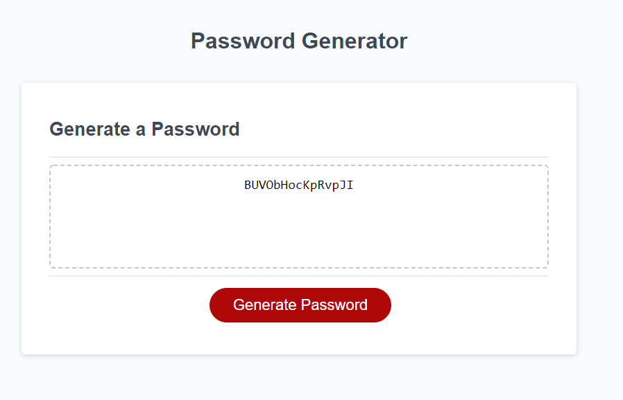

# MY Portfolio
## Description

This application is intended to provide the user with a randomly generated password.

## Installation
* None
## Usage
This repository can be opened as an HTML within Github at the website: https://teeemster.github.io/password-website/

On the website there is a "Generate Password" button. This button will bring up a form for the user to indicate the length of their password along with criteria for the characters, such as uppercase, lowercase, special characters and numeric.

    
## Credits
* Jonathan Beach
## License
* 

## Badges
  
* 
